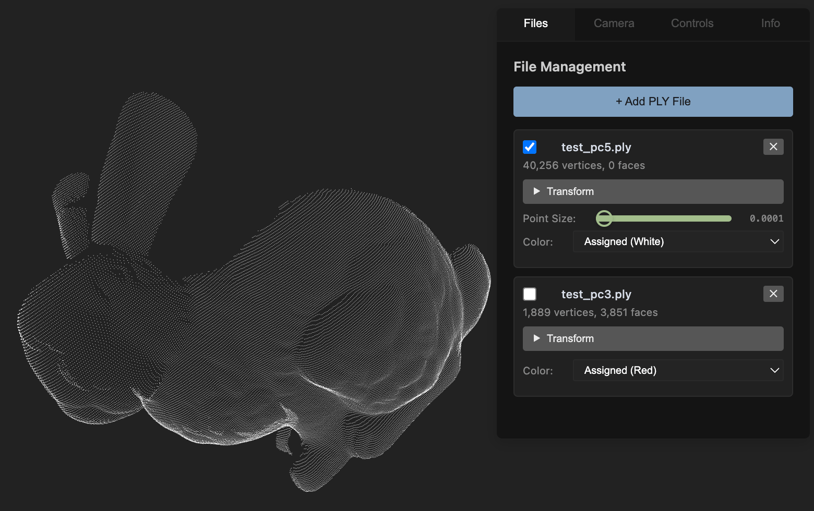

# PLY Pointcloud Visualizer

A Visual Studio Code extension for visualizing PLY (Polygon File Format) files with interactive 3D visualization using Three.js. It's currently mainly developed for point cloud visualization, but should work in the future equally well for any objects.

Info: This extension is actively developed. The current UI will frequently change and new features will be added. If you have feature requests or want to file a bug report, feel free to raise an github issue.

## Features

- **Visualize Point Clouds**: Navigate in colored or uncolored point clouds 
- **Fast Loading of Big Point Clouds**: Even point clouds with 5 Million Points load in around a second.
- **Compare Multiple Point Clouds**: Multiple point clouds can be loaded in the same view and activated and deactivated independently.
- **Multiple Formats**: Support for both ASCII and binary PLY formats and XYZ pointclouds
- **Rotation of points**: Rotation Matrix for single point clouds

Load two point clouds and switch between them imediatly pressing shift and click

## Theoretically supported PLY Features

- **Vertex Properties**:
  - Position (x, y, z)
  - Colors (red, green, blue, alpha)
  - Normals (nx, ny, nz)
- **Face Properties**:
  - Triangle and polygon faces
  - Automatic triangulation for complex polygons
- **Formats**:
  - ASCII PLY format
  - Binary PLY format (little-endian and big-endian)
  - XYZ point cloud format

## Known Issues and Missing Features
- **Wrong direction of Rotation**: When rotating the point cloud the direction is inversed. It's unclear how to fix this.
- **Bad use case knowledge for Shapes**: It was mainly tested for point clouds, since the author mainly works with point clouds.
- **Visualize Depth Image**: Interpret a depth image directly as a point cloud
- **Visualizing gaussian splats**: Add gaussian splat support
- **Add eye dome lighting**: Improve percenption of uncolored point clouds
- **Drag and Drop**: Add more pc to a given pc using drag and drop instead of adding them in an extra window
- **Support Obj files**: In Obj files point clouds and shapes can be stored. Add support for them.

## Feature Requests and Issues

If you have use cases that would be helpful for others or find problems, feel free to suggest them on the [GitHub repository](https://github.com/kleinicke/ply-visualizer/issues). If you know how to fix bugs or how to implement certain features, feel free to contribute.

